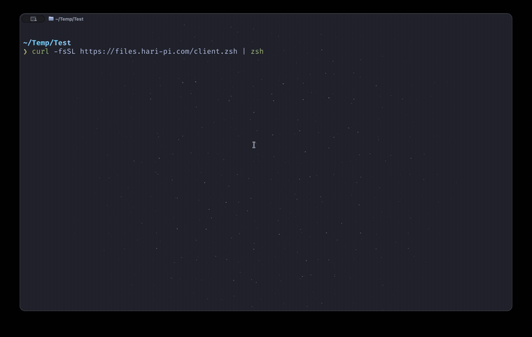

# TunnelPane

TunnelPane is a small self-hosted file service designed to sit behind an HTTPS reverse proxy or Cloudflare Tunnel. It provides a browser interface, direct HTTP uploads and downloads, and two-pane terminal clients for macOS/zsh and Windows PowerShell.

The service listens on loopback by default. It does not expose SSH or require inbound router port forwarding.

## Demo

[](https://raw.githubusercontent.com/Hari-Pi/tunnelpane/44215e12995c1c2761270fdfa72171db259fef6c/docs/tunnelpane-demo.mp4)

[Watch the full terminal demo](https://raw.githubusercontent.com/Hari-Pi/tunnelpane/44215e12995c1c2761270fdfa72171db259fef6c/docs/tunnelpane-demo.mp4) showing a rejected sign-in, masked-password authentication, pane navigation, parallel transfers, recursive folder upload, and server-folder browsing.

## Features

- Browser folder navigation, creation, upload, download, search, sorting, and deletion
- Resumable chunked browser uploads
- Responsive full-screen terminal interface with color-coded panes and aligned file metadata
- Hosted zsh and PowerShell launchers with no embedded credentials
- Parallel chunked uploads and range downloads with configurable worker count
- Recursive folder uploads that preserve nested and empty directories
- Responsive transfer progress with percentage, verified bytes, throughput, active workers, and persistent cancel hints
- Cancellable transfers and confirmation before file operations
- HTTP range requests for resumable downloads
- Basic authentication over HTTPS with only a SHA-256 password hash stored
- Authentication throttling and a read-only container filesystem

## Requirements

- Docker with Docker Compose
- An HTTPS reverse proxy or Cloudflare Tunnel
- A hostname such as `files.example.com`

## Setup

Clone this repository, then create the local configuration:

```sh
cd tunnelpane
cp .env.example .env
```

Generate a password hash on macOS or Linux:

```sh
printf %s 'your-password' | shasum -a 256
```

On Windows PowerShell:

```powershell
$sha = [Security.Cryptography.SHA256]::Create()
([BitConverter]::ToString($sha.ComputeHash([Text.Encoding]::UTF8.GetBytes("your-password")))).Replace("-", "").ToLower()
```

Put the username, hash, public HTTPS URL, and storage path in `.env`, then start the service:

```sh
docker compose up -d --build
```

Point the reverse proxy or Cloudflare Tunnel hostname at `http://localhost:3000`. Change `LISTEN_PORT` if port 3000 is already occupied.

## Terminal Clients

macOS or another system with zsh:

```sh
curl -fsSL https://files.example.com/client.zsh | zsh
```

Windows PowerShell:

```powershell
irm https://files.example.com/client.ps1 | iex
```

The clients ask for the username and a masked password. Neither credential is included in the public launcher.

Transfers use four concurrent workers by default. Set `TUNNELPANE_TRANSFERS` to a value from 1 through 8 before launching a client to override it:

```sh
curl -fsSL https://files.example.com/client.zsh | TUNNELPANE_TRANSFERS=6 zsh
```

```powershell
$env:TUNNELPANE_TRANSFERS = 6
irm https://files.example.com/client.ps1 | iex
```

### Keys

| Key | Action |
| --- | --- |
| `Tab`, left/right | Switch pane |
| Up/down, `j`/`k` | Move selection |
| `Enter` | Open a local folder |
| `u` | Upload the selected local file |
| `d` | Download the selected server file |
| `m` | Create a folder in the active pane |
| `x` | Delete the selected server file |
| `r` | Refresh both panes |
| `Esc`, `Ctrl+C` | Cancel without closing |
| `q` | Quit |

## Direct HTTP Usage

```sh
curl -u 'username:password' -T ./report.pdf https://files.example.com/report.pdf
curl -u 'username:password' -O https://files.example.com/report.pdf
wget --user=username --password=password https://files.example.com/report.pdf
```

Direct single-request uploads are limited to 95 MB by default. The browser and terminal clients upload larger files in 16 MB chunks, with the practical limit determined by available server storage.

## Security

- Keep `LISTEN_ADDRESS=127.0.0.1` unless you intentionally want LAN access.
- Use the service only behind HTTPS. Basic authentication is not safe over plaintext HTTP.
- Do not commit `.env`; it is ignored by Git.
- The server rejects hidden path segments, traversal attempts, and oversized names.
- Cloudflare configuration and access policies are intentionally outside this repository.

## Test

```sh
npm test
zsh -n client.zsh
```

## License

MIT
